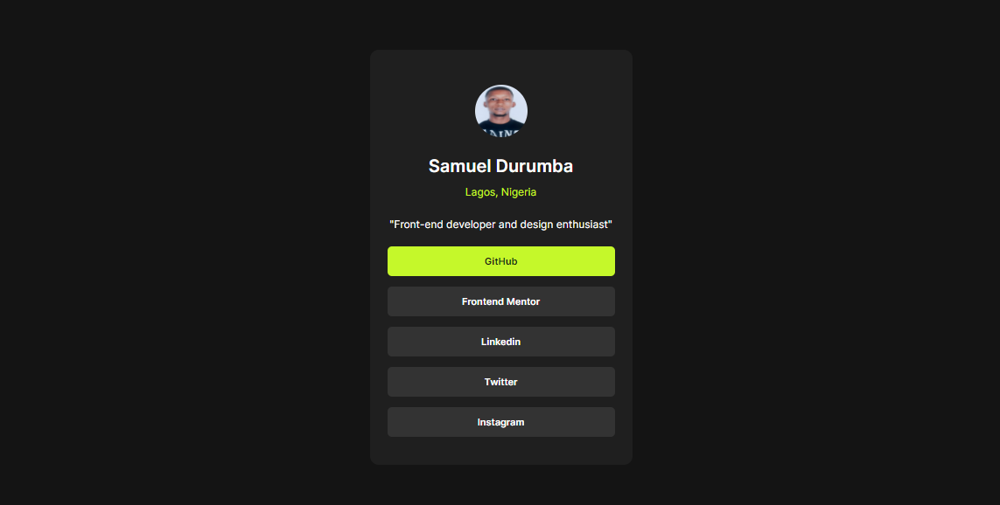
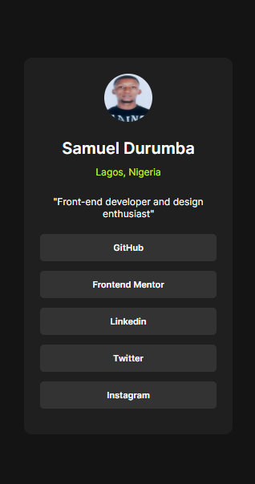

# Frontend Mentor - Social links profile solution

This is a solution to the [Social links profile challenge on Frontend Mentor](https://www.frontendmentor.io/challenges/social-links-profile-UG32l9m6dQ). Frontend Mentor challenges help you improve your coding skills by building realistic projects.

## Table of contents

- [Overview](#overview)
  - [The challenge](#the-challenge)
  - [Screenshot](#screenshot)
  - [Links](#links)
- [My process](#my-process)
  - [Built with](#built-with)
  - [What I learned](#what-i-learned)
  - [Continued development](#continued-development)
  - [Useful resources](#useful-resources)
- [Author](#author)

## Overview

### The challenge

Users should be able to:

- See hover and focus states for all interactive elements on the page

### Screenshot

- active states: 
- mobile design: 
- desktop design: 

### Links

- Solution URL: [GitHub repo](https://your-solution-url.com)
- Live Site URL: [Live page](https://your-live-site-url.com)

## My process

### Built with

- Semantic HTML5 markup
- CSS custom properties
- Flexbox
- Mobile-first workflow

### What I learned

I learned how to use variables for my css styles.

```css
:root {
  --primary-font-family: "Inter";
  --background-color: hsl(0, 0%, 8%);
  --profile-color: hsl(0, 0%, 12%);
  --nav-color: hsl(0, 0%, 20%);
  --hover-color: hsl(75, 94%, 57%);
  --font-color: hsl(0, 0%, 100%);
}

main {
  background: var(--background-color);
}
```

### Continued development

Howw to use other css libraries

### Useful resources

- [Example resource 1](www.w3schools.com) - This helped me refresh my memory about the target attribute for the <a> element

## Author

- Frontend Mentor - [@sammie-create](https://www.frontendmentor.io/profile/sammie-create)
